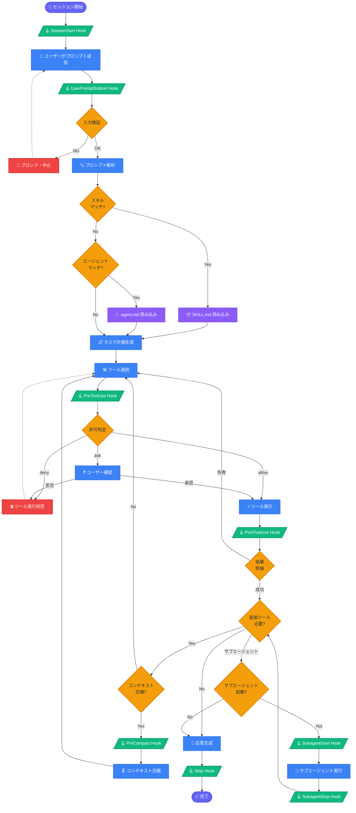
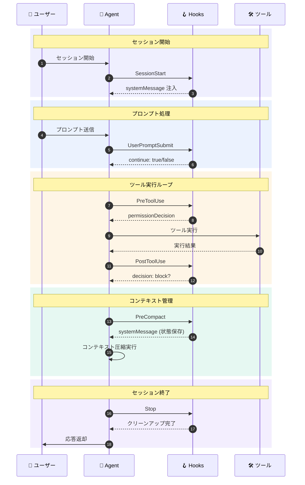
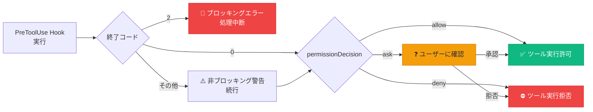

# GitHub Copilot Agent ライフサイクル フローチャート

> GitHub Copilot Agent がユーザーのプロンプトを受け取ってから応答を返すまでの全体フロー

---

## 全体フロー

---

## Hooks 発火タイミング

---

## ツール許可判定フロー

---

## 凡例

| 記号 | 意味 |
|:---:|---|
| 🟣 角丸ノード | 開始 / 終了 |
| 🔵 四角ノード | 処理ステップ |
| 🟡 ひし形ノード | 条件分岐 |
| 🟢 平行四辺形 | Hook 発火ポイント |
| 🔴 角丸ノード | エラー / ブロック |
| 💜 四角ノード | データ読み込み |
